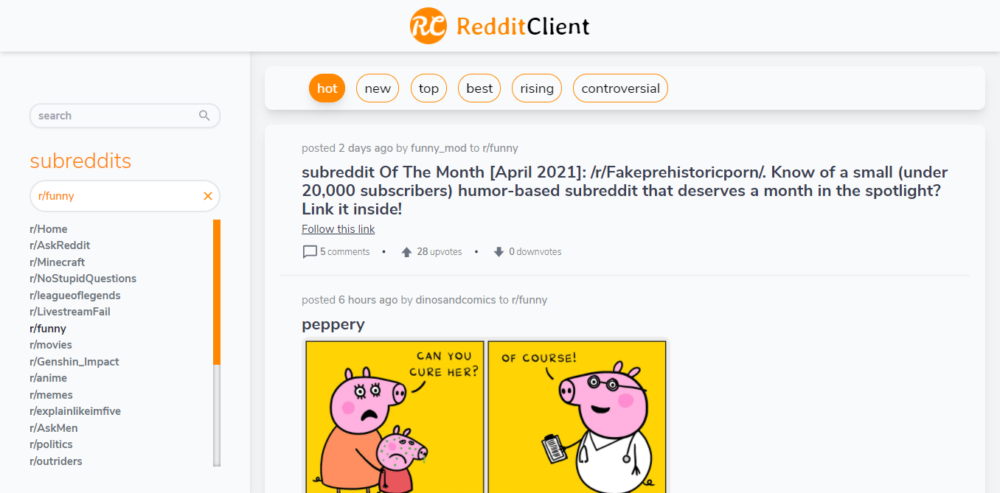
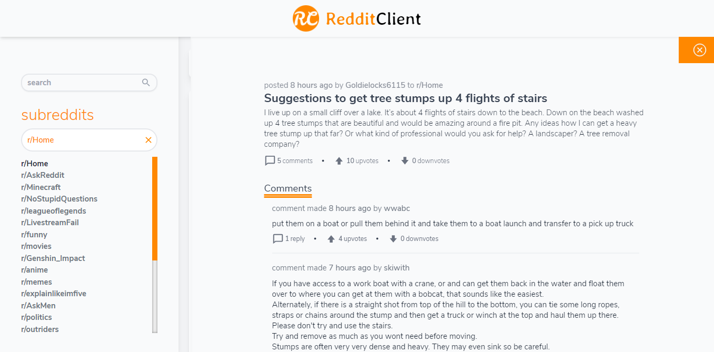

# Reddit Client  

> This is a web application that retrieves data from reddit using it's api and allows users to view and search posts and comments provided by the api.

## Table of contents  

- [General info](#general-info)
- [Screenshots](#screenshots)
- [Technologies](#technologies)
- [Setup](#setup)
- [Features](#features)
- [Status](#status)
- [Inspiration](#inspiration)
- [Contact](#contact)

## General info  

This project is built on reddit's api, user's are able to see an initial view when first visiting the site, they can search for posts using terms, can filter the results based on predefined categories and view comments under each post. It is responsive and can be used on any modern browser.

## Screenshots  

## Technologies  

- React - version 17.0.1  
- ReduxJS/Toolkit - version 1.5.0
- TailwindCSS - version 2.0.3
- TypeScript - version 4.0.3
- GSAP - version 3.6.0
- Node Sass - version 5.0.0
- VideoJS - version 7.11.4
- Enzyme - version 3.11.0
- DayJS - version 1.10.4
- HTML React Parser - version 1.2.4
- React Icons - version 4.2.0

## Setup  

Visit [redditclient](https://redditclient.netlify.app) i your browser.

## Features  

- Application can be used on any device
- Application can be used on any modern browser
- Shows an initial view of data to user on first visit
- Users can search data using terms
- Users can filter data based on predefined categories
- Users are shown a detail view when they select an item
- Users are able to leave an error state
- Application is a progressive web app

## Status  

Project is: _finished_

## Inspiration  

This project is inspired by a portfolio project on [codecademy's](https://www.codecademy.com/paths/full-stack-engineer-career-path) full stack engineer career path.

## Contact  

Created by [@funmilolajire](mailto:funmilolajire@gmail.com) - feel free to contact me!  
